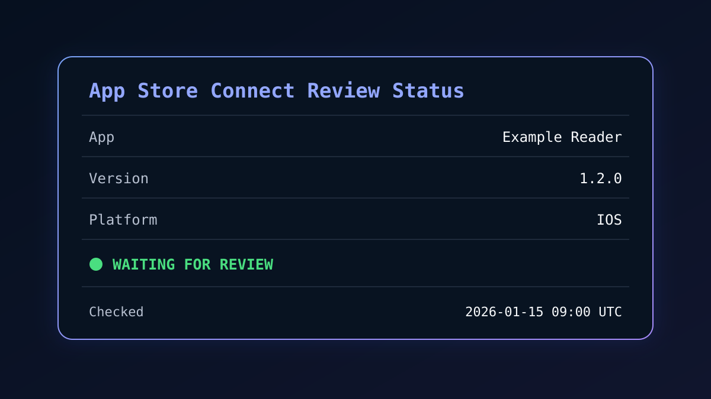

# App Review Status Skill

[English](README.md) | [简体中文](README.zh-CN.md)

A small, read-only Agent Skill that checks the current review state of App Store versions through Apple’s official App Store Connect API.

It answers questions such as:

- Is my app waiting for review?
- Has review started?
- Was the version rejected?
- Is the version ready for sale or distribution?



The public version is intentionally stateless. It reads the current status, prints the result, and exits. It does not schedule jobs, store history, estimate review time, open a browser, or modify App Store Connect.

## Get an App Store Connect API key

Start at [App Store Connect](https://appstoreconnect.apple.com/) and choose one of the following key types. Apple’s [official API setup guide](https://developer.apple.com/help/app-store-connect/get-started/app-store-connect-api/) documents both flows.

### Option A: Individual API key (recommended for personal use)

1. Sign in to App Store Connect.
2. Click your username in the top-right corner, then **Edit Profile**.
3. Under **Individual API Key**, click **Generate Key**.
4. Download the `.p8` file and note the **Key ID**.

An individual key inherits your user’s app access and permissions. It does not require an Issuer ID. Apple allows one active individual key per user.

### Option B: Team API key

1. In App Store Connect, open **Users and Access** → **Integrations**.
2. If API access has not been enabled, the Account Holder must first click **Request Access** and complete Apple’s approval flow.
3. Open **Team Keys** and click **Generate API Key** (or the `+` button).
4. Use any clear reference name, such as `app-review-status-readonly`.
5. Choose the least-privileged role that can view the intended apps, then generate the key.
6. Copy the **Issuer ID** and **Key ID**, and download the `.p8` file.

> Apple only lets you download a private API key once. Store it securely. Never commit the `.p8` file, a generated JWT, or a real configuration file to Git.

## Five-minute setup

### 1. Install the skill

The easiest Codex path is to ask Codex:

```text
Install the skill from https://github.com/XiaoshengChen/app-review-status
```

Codex installs GitHub-hosted skills into its skills directory. Start a new task after installation so the skill is available.

Manual installation:

```bash
git clone https://github.com/XiaoshengChen/app-review-status.git
cd app-review-status
mkdir -p ~/.codex/skills
ln -s "$(pwd)" ~/.codex/skills/app-review-status
```

Node.js 18 or newer is required.

### 2. Ask the skill to guide first-time setup

```text
Use $app-review-status to check my review status. I do not have an API key yet.
```

The skill will explain where to generate an individual or team API key, which non-secret values are needed, how to protect the `.p8` file, and how to create a private configuration. It will never ask you to paste the private-key contents.

You can run the fictional offline demo while obtaining credentials:

```bash
node scripts/app-review-status.mjs --fixture references/demo-response.json
```

### 3. Create a private configuration file

Keep this file outside the repository. For an individual key:

```json
{
  "keyType": "individual",
  "keyId": "YOUR_KEY_ID",
  "privateKeyPath": "/absolute/path/to/AuthKey_YOUR_KEY_ID.p8",
  "appIds": ["YOUR_APP_ID"]
}
```

For a team key, add the Issuer ID:

```json
{
  "keyType": "team",
  "issuerId": "YOUR_ISSUER_ID",
  "keyId": "YOUR_KEY_ID",
  "privateKeyPath": "/absolute/path/to/AuthKey_YOUR_KEY_ID.p8",
  "appIds": ["YOUR_APP_ID"]
}
```

`appIds` is optional. If omitted, the script checks every app visible to the key.

### 4. Protect the private key

On macOS or Linux:

```bash
chmod 600 /absolute/path/to/AuthKey_YOUR_KEY_ID.p8
```

### 5. Run the check

```bash
node scripts/app-review-status.mjs --config /absolute/path/to/config.json
```

## Example result

The image above and the output below use fictional data only:

```markdown
# App Store Connect Review Status

Checked: 2026-01-15T09:00:00.000Z

| App | Version | Platform | Status |
| --- | --- | --- | --- |
| Example Reader | 1.2.0 | IOS | `WAITING_FOR_REVIEW` |
```

## Other output options

Machine-readable JSON:

```bash
node scripts/app-review-status.mjs --config /absolute/path/to/config.json --format json
```

Return every App Store version instead of only the newest per platform:

```bash
node scripts/app-review-status.mjs --config /absolute/path/to/config.json --all-versions
```

## Install as an Agent Skill

For Codex, the installation command above places or symlinks the repository in `~/.codex/skills/app-review-status`. If you cloned it elsewhere, run:

```bash
mkdir -p ~/.codex/skills
ln -s "$(pwd)" ~/.codex/skills/app-review-status
```

Start a new Codex task after installation so it can discover the skill.

Then ask:

```text
Use $app-review-status to check the current App Store Connect review status with config /absolute/path/to/config.json.
```

## How it works

1. The script reads a private local configuration containing the key type, identifiers, `.p8` path, and optional App IDs.
2. It creates a short-lived JSON Web Token in memory and signs it locally with ES256.
3. It performs authenticated `GET` requests to resolve accessible apps and read their App Store versions.
4. It selects the newest version for each app/platform pair and renders Markdown or JSON.

The status comes from Apple’s `appVersionState` field, with `appStoreState` used only as a compatibility fallback. The private key and JWT are never printed or written to disk.

## Repository layout

```text
app-review-status/
├── SKILL.md
├── agents/openai.yaml
├── assets/example-output.svg
├── scripts/app-review-status.mjs
└── references/
    ├── config.example.json
    ├── config.individual.example.json
    ├── demo-response.json
    ├── limitations.md
    └── setup.md
```

## Security properties

- Read-only: the implementation contains no POST, PATCH, PUT, or DELETE requests.
- Stateless: it does not create a history or status cache.
- Local credentials: the `.p8` key stays on the machine; only a short-lived signed JWT is sent for authentication.
- Short-lived JWT: the generated token expires after 10 minutes and exists only in process memory.
- Private-key permission check: on macOS and Linux, the script refuses group- or world-readable key files.
- Credential-safe examples: the repository contains placeholders and synthetic fixtures only.

## Limitations

- Apple returns the current state, not the exact time the version entered that state.
- The API does not return the App Review conversation or detailed rejection reason.
- This project does not calculate queue duration or approval ETA.
- Access depends on the apps and role associated with the API key.

## Official references

- [App Store Connect API setup and key generation](https://developer.apple.com/help/app-store-connect/get-started/app-store-connect-api/)
- [Creating API Keys for App Store Connect API](https://developer.apple.com/documentation/appstoreconnectapi/creating-api-keys-for-app-store-connect-api)
- [Generating Tokens for API Requests](https://developer.apple.com/documentation/appstoreconnectapi/generating-tokens-for-api-requests)
- [List all App Store versions for an app](https://developer.apple.com/documentation/appstoreconnectapi/get-v1-apps-_id_-appstoreversions)

## License

MIT

— [chenxs.com](https://chenxs.com)
